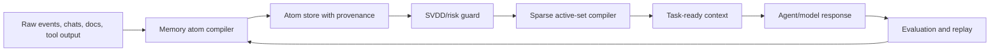

# Octopus V3 Upgrade Planning

[](https://github.com/tjbmoose09/octopus-v3-planning/actions/workflows/ci.yml)
[](https://github.com/tjbmoose09/octopus-v3-planning/actions/workflows/secret-scan.yml)

Public upgrade guide for moving **Octopus Agents V2.2** toward the V3 data-plane architecture: sparse memory, safer context compilation, faster prompt construction, and benchmark-driven algorithm selection.

This repository is not a drop-in replacement for `octopus-v2` yet. It is the public planning and benchmark packet people can pull before implementing the V3 branch.

## Quick Start

If you already cloned this planning repo:

```powershell
cd "octopus-v3-planning"
git pull origin main
```

If you are starting from an Octopus V2.2 checkout:

```powershell
cd "octopus-v2"
git clone https://github.com/tjbmoose09/octopus-v3-planning.git ../octopus-v3-planning
cd ../octopus-v3-planning
python scripts/simulate_v3_memory.py
```

If you want the planning docs available inside your V2.2 working tree without mixing git histories:

```powershell
cd "octopus-v2"
New-Item -ItemType Directory -Force -Path docs/v3-planning
Copy-Item -Recurse ..\octopus-v3-planning\docs\* docs\v3-planning\
```

## What V3 Changes

V2.2 proved that a 34-agent local-first mesh can run on one workstation. V3 focuses on making the information flow smaller, safer, and faster.

| Area | V2.2 behavior | V3 target |
|---|---|---|
| Memory shape | Transcript-heavy task/message history | Sparse typed memory atoms |
| Context loading | Broad retrieval and large summaries | Active-set context compiler |
| Compaction | Summarize after pressure builds | Compile, decompile, and recompile continuously |
| Routing | Agent-role routing plus zone gates | Risk-aware data routing plus zone gates |
| Safety | `.gitignore`, manual scans, public-release checks | Per-atom risk scoring and export gates |
| Benchmarking | Early harness, quality score still a stub | Algorithm tournament with replay and evaluator scoring |
| Observability | Pipeline events and mesh UI | Context provenance and "why this atom loaded" traces |

## Upgrade Roadmap

| Phase | Upgrade | Files to build in V2.2 | Success signal |
|---:|---|---|---|
| 0 | Keep V2.2 stable | No runtime change | Existing app still boots and routes |
| 1 | Add simulation harness | `benchmark/v3_memory_sim.py` or equivalent | V2 baseline numbers reproduce |
| 2 | Add memory atoms | `memory/atoms.py`, schema migration | Chats/tool outputs compile into atoms |
| 3 | Add sparse context compiler | `memory/compiler.py` | Active prompt tokens drop without losing key facts |
| 4 | Add SVDD-style risk guard | `memory/risk.py`, export checks | Secret-looking atoms are quarantined |
| 5 | Add SDARP-style routing score | `routing/data_router.py` | Data path includes utility, risk, freshness, cost |
| 6 | Add loop-tiled batch jobs | `memory/batch.py` | Embedding/index rebuilds run faster on large histories |
| 7 | Add live model replay | `benchmark/replay.py` | Local models confirm synthetic gains |
| 8 | Promote V3 branch | `v3/*` or `main` after review | Public README can claim real measured gains |

## Algorithm Upgrade Table

| Concept | Why it matters | V3 use | Status |
|---|---|---|---|
| DICG-inspired active set | Avoid carrying a huge decomposition/history | Select "toward" memory atoms and evict "away" atoms | Proposed and simulated |
| Loop nesting/data locality | Reduce repeated scans and cache misses | Batch embedding, index rebuilds, journal compaction | Planned |
| SVDD | Detect outliers from normal project memory | Flag risky memory writes, leaks, drift, odd context | Planned |
| SDARP-style routing | Route data by security and utility | Choose local/cloud/memory/export path by risk and value | Planned |
| Asif-related compression bucket | Ambiguous term; needs exact source | Test DCT/wavelet/delta compression variants | Research bucket |
| OctoSparse DICG | Octopus-specific synthesis | Sparse compiler with risk penalty and provenance | First candidate |

## Simulation Result

The current simulation compares a V2.x broad context loader against a V3 sparse compiler over the available Octopus V2 repo corpus.

| Metric | V2.x broad baseline | V3 sparse compiler | Simulated change |
|---|---:|---:|---:|
| Mean active context | 2717.1 tokens | 545.8 tokens | 79.9% fewer tokens |
| Median active context | 2642.5 tokens | 535.5 tokens | 79.7% fewer tokens |
| Mean selected chunks | 24.0 | 5.1 | 78.6% smaller active set |
| Mean synthetic precision | 0.958 | 0.938 | 2.2% relative drop |
| Estimated prompt eval @ 75 tok/s | 36.23 s | 7.28 s | 79.9% faster |

Important: this is a deterministic data-plane simulation, not a live LLM benchmark. LM Studio was not reachable during the first run, so no production model-speed claim is made yet.

Read the full report: [docs/SIMULATION_RESULTS.md](docs/SIMULATION_RESULTS.md)

## Recommended V2.2 Implementation Order

| Priority | Change | Reason |
|---:|---|---|
| 1 | Add reproducible benchmark replay | Prevents V3 from becoming hand-wavy |
| 2 | Introduce memory atoms next to existing tables | Low-risk migration path |
| 3 | Add sparse compiler behind a feature flag | Allows A/B testing against V2.2 |
| 4 | Add provenance to every context block | Makes compression auditable |
| 5 | Add leak/risk score before GitHub export | Protects public releases |
| 6 | Add UI explanation panel | Shows why context was loaded |
| 7 | Run live LM Studio replay | Converts simulation into real benchmark data |

## Proposed V3 Data Flow



## Repo Map

| Path | Purpose |
|---|---|
| `docs/V3_SCOPE.md` | V3 scope and acceptance criteria |
| `docs/ALGORITHM_RESEARCH.md` | Research notes on DICG, SVDD, SDARP, loop optimization, and Asif-related buckets |
| `docs/OCTOSPARSE_DICG_ALGORITHM.md` | Proposed Octopus-specific sparse memory algorithm |
| `docs/STRESS_TEST_PLAN.md` | Tournament plan for comparing algorithms against V2.x |
| `docs/MIND_MAP.md` | Mermaid mind map of V3 planning |
| `docs/SIMULATION_RESULTS.md` | Current synthetic benchmark result |
| `scripts/simulate_v3_memory.py` | Dependency-free simulation harness |
| `results/` | JSON and JSONL simulation outputs |

## Guardrails Before Claiming V3 Performance

Do not publicly claim production speedups until:

- the V2.2 baseline is run from the same machine
- LM Studio/local model replay completes
- evaluator-graded answer quality replaces synthetic precision
- long-running task replay passes forced compaction
- leak/risk scans pass on generated outputs and repo commits

The current defensible claim is:

> In a synthetic data-plane simulation over the available Octopus V2 corpus, the sparse compiler reduced active context tokens by about 80%, with a small synthetic precision drop. This suggests a strong V3 direction, but live model replay is still required.

## License

Use this planning packet to guide Octopus V2.2/V3 upgrades. Add a formal license before accepting outside contributions.
