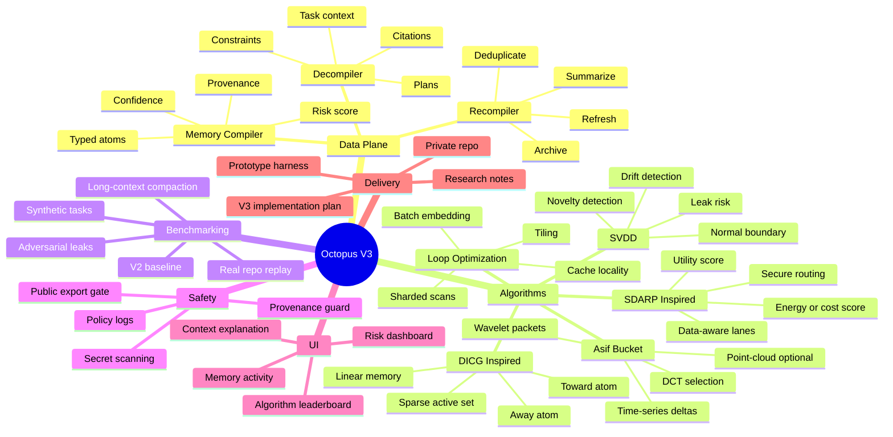

# Octopus V3 Mind Map

```mermaid
mindmap
  root((Octopus V3))
    Data Plane
      Memory Compiler
        Typed atoms
        Provenance
        Confidence
        Risk score
      Decompiler
        Task context
        Plans
        Citations
        Constraints
      Recompiler
        Deduplicate
        Summarize
        Archive
        Refresh
    Algorithms
      DICG Inspired
        Sparse active set
        Toward atom
        Away atom
        Linear memory
      SVDD
        Normal boundary
        Novelty detection
        Leak risk
        Drift detection
      SDARP Inspired
        Secure routing
        Utility score
        Energy or cost score
        Data-aware lanes
      Loop Optimization
        Tiling
        Batch embedding
        Cache locality
        Sharded scans
      Asif Bucket
        DCT selection
        Wavelet packets
        Time-series deltas
        Point-cloud optional
    Benchmarking
      V2 baseline
      Synthetic tasks
      Real repo replay
      Adversarial leaks
      Long-context compaction
    Safety
      Secret scanning
      Public export gate
      Provenance guard
      Policy logs
    UI
      Memory activity
      Context explanation
      Risk dashboard
      Algorithm leaderboard
    Delivery
      Private repo
      Research notes
      Prototype harness
      V3 implementation plan
```

